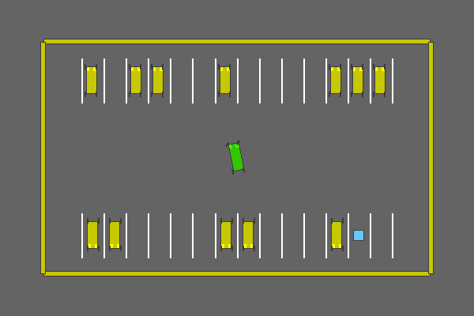
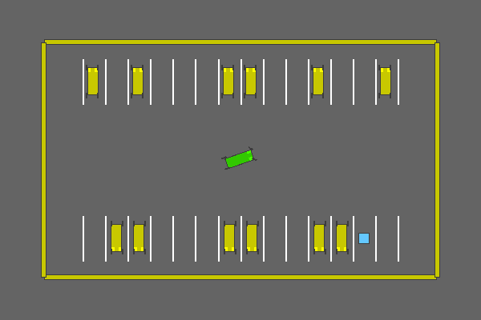

# Automatic-Parking
A simulation-based automatic parking solution using reinforcement learning, applicable to single agent environments.

## Problem
Parking presents unique challenges to drivers, requiring
precise maneuvering in limited space and creativity navigating
through spaces without strict road guidelines. Automated park-
ing is mandatory to achieve full end-to-end self driving (FSD)
but is often viewed as a convenience because of a decreased
danger level relative to road navigation. The demand for
improved automatic parking systems will increase alongside
FSD adoption rates. Automated parking systems also open
the door for collaborative parking agents, in contrast to the
traditionally competitive nature of parking.

This project seeks to develop a self-driving parking algorithm in a simulated environment that is extensible to multi-agent collaboration.

## Demo



*Figure: Example of the trained agent performing automatic parking in the simulation environment with deterministic policy. (success rate: 0.95)*



*Figure: Example of the trained agent performing automatic parking in the simulation environment with stochastic policy (success rate: 0.92).*

## Directory Structure
```
📦 
├─ requirements.txt                 # Required Python packages
├─ res                              # Training logs, evaluation results, model
│  ├─ logs                          # Training logs, plots
│  │  └─ parking_policy
│  │     ├─ <timestamp>             # Logs for a particular run
│  ├─ multiagent                    # Multi-agent training logs
│  ├─ parking_policy                # Last trained model
│  │  ├─ model.zip
└─ src
   ├─ custom_environment            # Custom parking environment
   │  ├─ __init__.py
   │  └─ custom_parking_env.py
   ├─ custom_observation.py         # Custom observation that includes other cars
   ├─ custom_observation_multi.py   # Custom observation for multi-agent setup
   ├─ environment.py                # Parking environment action and observation space
   ├─ evaluation.py                 # Evaluation script for trained model
   ├─ multiagent_env.py             # Multi-agent environment
   ├─ multiagent_train_approach1.py # Multi-agent training approach 1
   ├─ multiagent_train_approach2.py # Multi-agent training approach 2
   ├─ parking_env.py                # Environment with custom observation
   ├─ parking_env_multi.py          # Environment with custom observation for multi-agent setup
   ├─ parking_obstacles.py          # Custom observation
   ├─ plotting.py                   # Script to generate plots on training 
   ├─ single_train.py               # Script to train a single-agent
   └─ single_train_custom_observation.py # Script to train a single agentn with custom observation
```
©generated by [Project Tree Generator](https://woochanleee.github.io/project-tree-generator)

## Dependencies
1. highway-env
2. tqdm
3. numpy<2
4. matplotlib
5. scikit-learn
6. rich
7. pandas
8. gymnasium
9. stable-baselines3
10. torch
11. seaborn
12. imageio

## How to Run the Project
### Setup
#### 1. Clone the repository
```
git clone <SSH_URL>
```
#### 2. Navigate to the repository root
```
cd Automatic-Parking
```
#### 3. Pre-requisite
Make sure Python 3.11 or above is installed.

#### 4. Install required dependencies
Make sure you are in the root directory of the repo
```
pip install -r requirements.txt
```

#### 5. Train a single-agent
1. Navigate to the src directory.
    ```
    cd src
    ```
2. Open single_train.py file in an editor.
3. Set TRAIN to True. Set CONTINUE_TRAINING to True to continue training the previously saved model.
4. Change other hyperparamters as required and save the file.
5. Run the single_train.py file.
   ```
   python single_train.py
   ```
6. The model, logs, and plots are stored in res directory in the root directory.

#### 6. Evaluate the trained model.
1. Open single_train.py file in an editor.
2. Set TRAIN to False.
3. Set RECORD to True to create GIFs of each episode run during evaluation.
4. Run the single_train.py file.
   
   The model will be evaluated on 1000 episodes and success rate will be shown upon completion.
5. If RECORD was set to True, GIFs will be saved in res directory n the root directory.


## Enhancements/Future Work
1. Multiple ego vehicles that coordinate with each other to maximize parking efficiency
2. Parking in a space with other moving vehicles
3. Use observations like LiDAR to detect nearby vehicles
4. Experiment with different parking lot layouts
5. Use more realistic simulation environment like CARLA
6. Try other reinforcement learning models

## Contributing:
To contribute to this project, please create the fork of this repository and submit a pull request.

## Resources:
1. [highway-env](https://highway-env.farama.org/#)
2. [Stable Baselines3](https://stable-baselines3.readthedocs.io/en/master/index.html)

## Contributors:
* Ryan Dunn ([RyanDunnNEU](https://github.com/RyanDunnNEU))
* Meet Katrodiya ([MKatrodiya](https://github.com/MKatrodiya))
* Lijiao Wang ([WangLetitia](https://github.com/WangLetitia))
